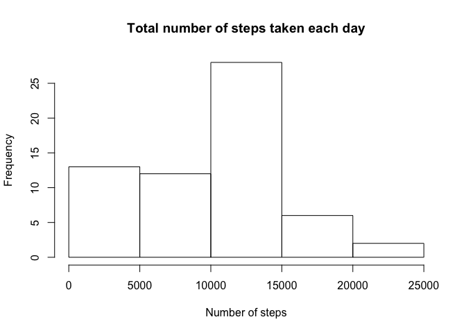

# Reproducible Research: Peer Assessment 1


## Loading and preprocessing the data

```r
activity<-read.csv("activity.csv")
```

## What is mean total number of steps taken per day?


```r
sumSteps <- tapply(activity$steps, activity$date, sum, na.rm = TRUE)
hist(sumSteps, xlab = 'Number of steps', main = 'Total number of steps taken each day')
```

 


```r
mean(sumSteps)
```

```
## [1] 9354.23
```

```r
median(sumSteps)
```

```
## [1] 10395
```
## What is the average daily activity pattern?

```r
activity$interval <- as.factor(activity$interval)
avgSteps <- tapply(activity$steps, activity$interval, mean, na.rm = TRUE)
plot(x = levels(activity$interval), y = avgSteps, type = "l", xlab = 'Time', ylab = 'Number of steps', main = 'Average number of steps taken in 5-minute interval')
```

 

We can find the 5-minute interval with the maximum by using the function which.max

```r
which.max(avgSteps)
```

```
## 835 
## 104
```
## Imputing missing values

The total number of missing values in the data set is given by

```r
sum(is.na(activity$steps))
```

```
## [1] 2304
```

The total number of missing values in the dataset is 2304.

Next we replace every missing value in the dataset with the mean of its corresponding 5-minute interval.


```r
activity.new <- activity
n<-length(activity$steps)
x<-rep(avgSteps,n/length(avgSteps))
for (i in 1:n){
  if (is.na(activity.new$steps[i])) 
    activity.new$steps[i] <- x[i]
}
```


```r
sumSteps.new <- tapply(activity.new$steps, activity.new$date, sum)
hist(sumSteps.new, xlab = "Number of steps", main = "Total number of steps taken each day")
```

 

```r
mean(sumSteps.new)
```

```
## [1] 10766.19
```

```r
median(sumSteps.new)
```

```
## [1] 10766.19
```
 
As we can see, this hardly changes the values which we calculated before. The mean and median are really close (and indeed the same) since we are replacing missing values with their average.

## Are there differences in activity patterns between weekdays and weekends?


```r
daytype <- function(date) {
  if (weekdays(as.Date(date)) %in% c("Saturday", "Sunday")) {
    "Weekend"
  } else {
    "Weekday"
  }
}
activity.new$dayType <- as.factor(sapply(activity.new$date, daytype))
head(activity.new)
```

```
##       steps       date interval dayType
## 1 1.7169811 2012-10-01        0 Weekday
## 2 0.3396226 2012-10-01        5 Weekday
## 3 0.1320755 2012-10-01       10 Weekday
## 4 0.1509434 2012-10-01       15 Weekday
## 5 0.0754717 2012-10-01       20 Weekday
## 6 2.0943396 2012-10-01       25 Weekday
```

```r
par(mfrow = c(2, 1))
for (type in c("Weekend", "Weekday")) {
  steps.type <- aggregate(steps ~ interval, data = activity.new, subset = activity.new$dayType == type, FUN = mean)
  plot(steps.type, type= "l", main = type,xlab = "Interval", ylab = "Number of steps" )
}
```

 

I wouldn't say there are a lot of differences between weekends and weekdays except the fact that people tend to wake up a bit later and exercise less on weekends, as evidenced by a smaller lagged peak of activity in the upper panel plot (weekends) compared to the lower panel plot (weekdays).
